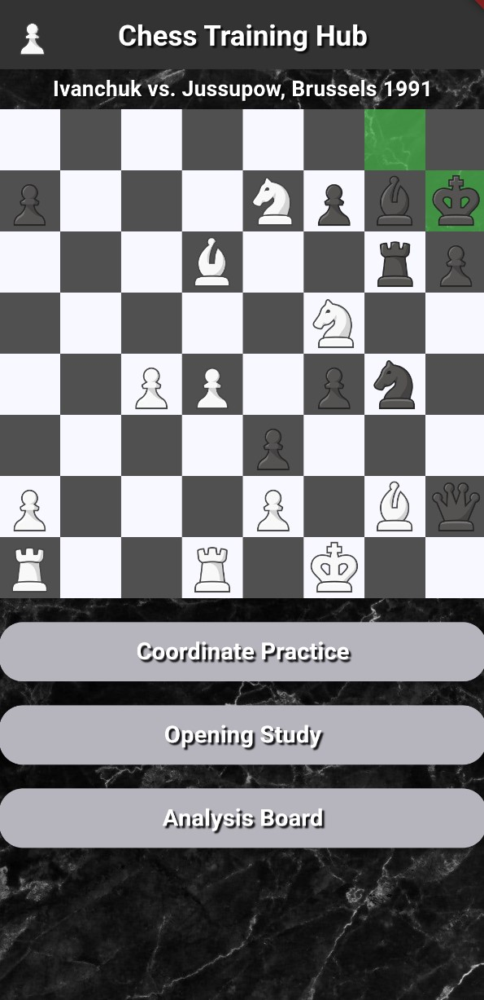
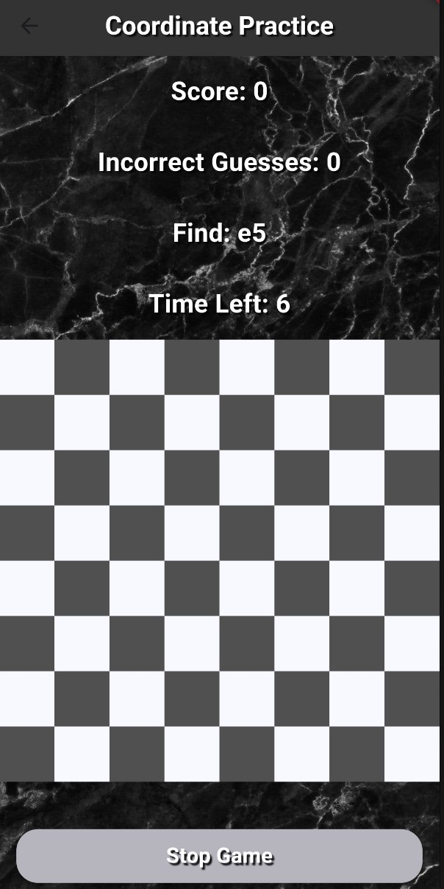
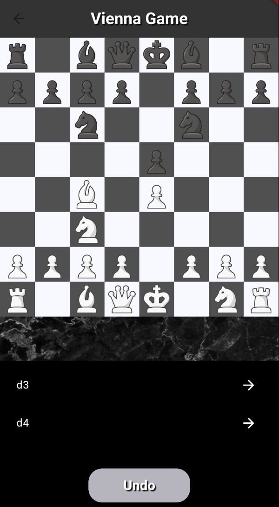
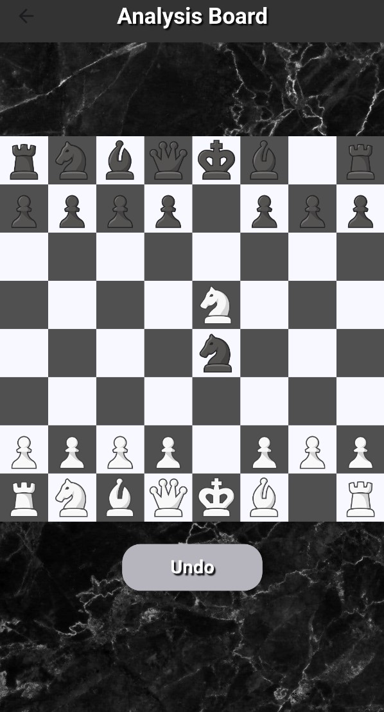

# Chess App

Welcome to the Chess Training Hub. This application is designed to help chess enthusiasts improve their skills through various interactive features such as coordinate practice, opening study, and an analysis/play board. The app also features a famous chess game playing out on the home screen for inspiration and learning or simply entertainment.

## Features

1. **Home Screen**:
   - Displays a famous chess game playing out automatically.
   - Games selected based on populairty
   - PGN files of user games could also be uploaded
  
   

2. **Coordinate Practice**:
   - Helps users practice their knowledge of chess board coordinates.
   - Interactive exercises to improve board visualization skills.
   - Played in multiple time controls to increase difficulty over time
  
   

3. **Opening Study**:
   - Allows users to study different chess openings.
   - Users can select an opening and explore the move tree to understand various lines and variations.
   - 
   

4. **Analysis Board**:
   - A sandbox board where users can set up positions and analyze different scenarios.
   - Ideal for testing out strategies and moves without the constraints of a game.
   - Can also be used to play someone in a real game locally (using one phone as a board).
  
   

## Getting Started

### Prerequisites

- **Flutter SDK**: Make sure you have Flutter installed on your system. If not, you can download it from [flutter.dev](https://flutter.dev).

### Installation

1. **Clone the repository**:
   ```bash
   git clone https://github.com/yourusername/chess-app.git

2. **Navigate, Install dependencies, Run app**:
  ```bash
  cd chess-app
  flutter pub get
  flutter run
 ```

## Usage

### Home Screen
When you open the app, you will be greeted with the home screen displaying a famous chess game. This game plays out automatically.

### Coordinate Practice
Click on the "Coordinate Practice" button to start practicing your board coordinates. This feature will present you with various squares to identify, helping you become more familiar with the chessboard layout.

### Opening Study
Click on the "Opening Study" button to choose an opening to study. You can explore different chess openings, their main lines, and side variations. The app provides a move tree for each opening, allowing you to delve into various possibilities and learn the best responses (currently limited to 3 openings, more to be added).

### Analysis Board
Click on the "Analysi Board" button to access a sandbox board. Here, you can set up any position and analyze different moves and strategies. This is perfect for experimenting with new ideas and improving your tactical skills.

## Code Overview

### Main Components

- **main.dart**: The entry point of the app.
- **home_screen.dart**: Contians all UI elements of the home screen
- **famous_game.dart**: Contians UI and logic for replaying of a game from a PGN file
- **app_theme.dart**: Contains pre defined themes to be used for app design
- **opening_study.dart**: Contains UI for choosing an opening from a list
- **opening_study.dart**: Contains UI for choosing an opening
- **opening_study_board.dart**: Contains the UI and logic for the Opening Study feature.
- **coordinate_practice.dart**: Manages the coordinate practice functionality.
- **chess_board.dart**: Implements the sandbox board for free analysis.
- **settings_page.dart**: Contains UI and logic for settings poage (CURRENTLY NOT FUNCTIONAL)


